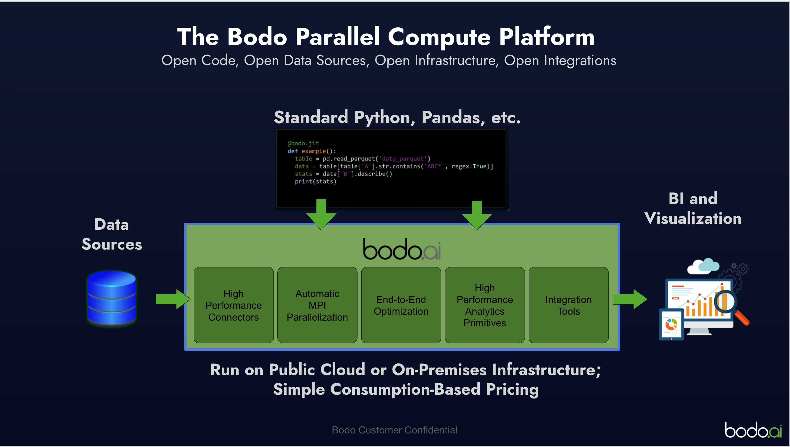
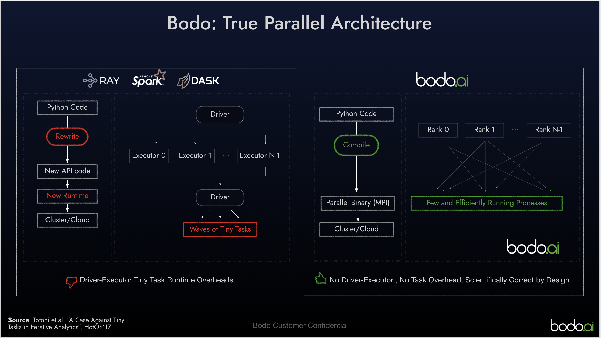
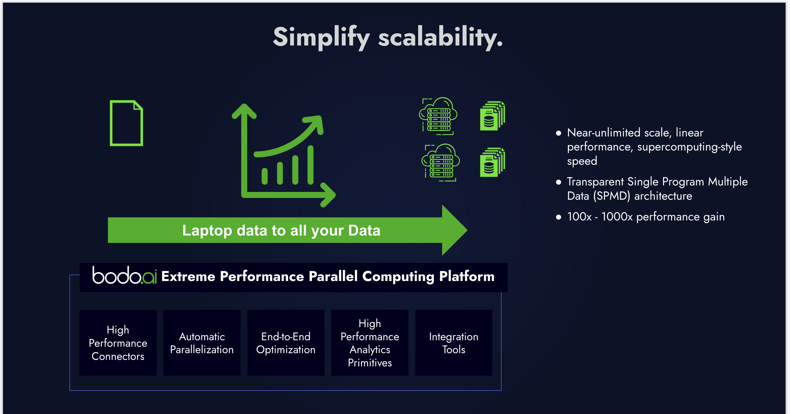

# **Bodo Introduction**

---

### Bodo platform is a high performance data platform for all your data processing needs. Data Engineering, analytics,ETL, ML can be done on the bodo platform and scaled to 1000s of cores for superior performance , compared to Ray/Spark/Dask. click here for more details on performance benchmarks. <a href="https://www.bodo.ai/blog/performance-and-cost-of-bodo-vs-spark-dask-ray">Bodo Benchmark comparison</a>
### In ideal circumstances bodo can be 20x-30x faster spark on compute operation. On most cases we can safely expect a 2x-3x improvement, which could mean 50% reduction in costs or SLA</h4></p>


### Bodo has a superior mpi based architecture, compared to the sparks map reduce architecture, which leads to better and efficient use of available resources. This means jobs are faster and have predicatable run times as you scale for mode data.
### Additionally, bodos JIT compiler optimizes simple pandas code for efficiency and allows it to run on mmultiple cores in a distributed manner. This means no rewrite of code is needed when transitioning from a single core (laptop) execution to a multi-core execution across your enterprise. This makes the maintainance of complicated data jobs very simple and straightforard.



# **Getting Started**
### Getting started using Bodo is very simple. There are two ways, 
1. ### Bodo Platform
#### Bodo platform is a pay as you go SAAS. simply register for the bodo platform using your cloud provider (Amazon, Azure , GCP (coming soon)). Bodo platform a simple click based way of managing and runnig bodo workloads. 
### You can register for a free trial [here](https://aws.amazon.com/marketplace/pp/prodview-zg6n2qyj5h74o)
- [Instructions for Deploying on AWS](https://www.example.com)
- [Instructions for Deploying on Azure](https://www.example.com)

2. ### Bodo Community Edition
#### Bodo Community edition is a simple free to use license of bodo (upto 8 cores). This is useful if you do not have access to a cloud environment or want to try Bodo out locally. Once you are ready and want to scale your workload, you can either leverage the cloud platform or request an enterprise license.
#### You can get started with bodo by simply installing bodo using pip as follows
> pip install bodo
#### Lets run our first bodo code, simply copy the below code to a file "/tmp/pi.py"
```python

import bodo
import numpy as np
import argparse
import time


@bodo.jit
def calc_pi(n):
    t1 = time.time()
    x = 2 * np.random.ranf(n) - 1
    y = 2 * np.random.ranf(n) - 1
    pi = 4 * np.sum(x ** 2 + y ** 2 < 1) / n
    print("Execution time:", time.time() - t1, "\nresult:", pi)
    return pi


def main():
    parser = argparse.ArgumentParser(description="Monte Carlo Pi Calculation.")
    parser.add_argument("--points", dest="points", type=int, default=200000000)
    args = parser.parse_args()
    points = args.points
    calc_pi(points)